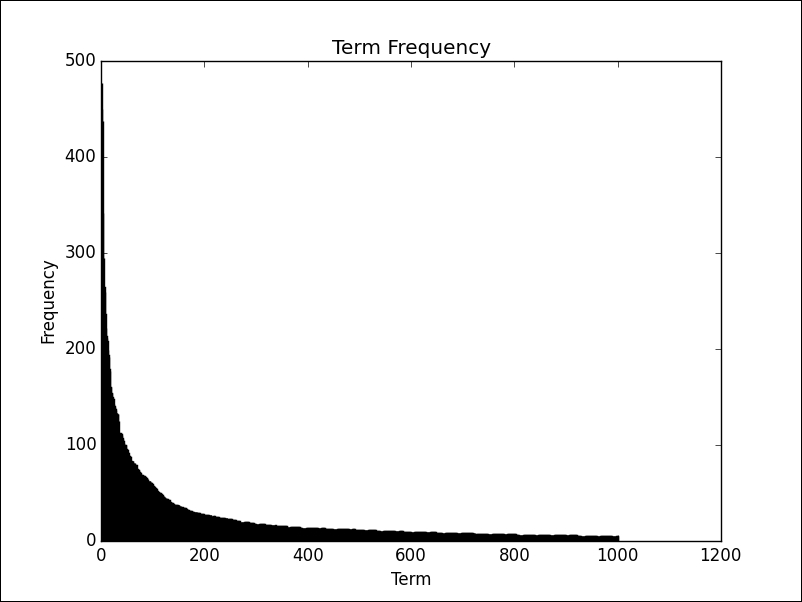

### Analyzing tweets - text analysis

**Tokenization** is one of the important steps in the preprocessing phase. Given a stream of text (such as a tweet status), tokenization is the process of **breaking this text down into individual units called tokens**. In the simplest form, these units are words, but we could also work on a more complex tokenization that deals with phrases, symbols, and so on.

Another preprocessing step that is worth considering is **stop word removal**. **Stop words are words that, when taken in isolation, are not content-bearing.** This category of words include articles, propositions, adverbs, and so on. Frequency analysis will show that these words are typically the most common in any dataset. While a list of stop words can be compiled automatically by analyzing the data (for example, by including words that are present in more than an arbitrary percentage of the documents, such as 95%), in general, it pays off to be more conservative and use only common English stop words. NLTK provides a list of common English stop words via the `nltk.corpus.stopwords` module.

Stop word removal can be extended to include symbols as well (such as punctuation) or domain-specific words. In our Twitter context, common stop words are the terms **RT (short for Retweet) and via**, often used to mention the author of the content being shared.

Finally, another important preprocessing step is **normalization**. This is an umbrella term that can consist of several types of processing. In general, normalization is used when we need to aggregate different terms in the same unit. The special case of normalization considered here is **case normalization**, where every term is lowercase so that strings with originally different casing will match (for example, `'python' == 'Python'.lower()`). **The advantage of performing case normalization is that the frequency of a given term will be automatically aggregated, rather than being dispersed into the different variations of the same term.**

Maybe something that we didn't expect is the presence of tokens such as `we're` and `we'll`, because these are contracted forms of two separate tokens, rather than individual tokens on their own. If the contracted form is expanded, in both cases (*we are* and *we will*), all we have is a sequence of stop words because these contracted forms are usually pronouns and common verbs. A full list of English contractions is given on, for example, Wikipedia (https://en.wikipedia.org/wiki/Wikipedia%3aList_of_English_contractions).

One way to deal with this aspect of the English language is to normalize these contractions into their extended form. For example, the following function takes a list of tokens and returns a normalized list of tokens (to be more precise, a generator, as we're using the `yield` keyword):

The curve that we can observe in above picture represents an approximation of a **power law** (https://en.wikipedia.org/wiki/Power_law). In statistics, a power law is a functional relationship between two quantities; in this case, the frequency of a term and its position within the ranking of terms by frequency. This type of distribution always shows a **long tail** (https://en.wikipedia.org/wiki/Long_tail), meaning that a small portion of frequent items dominate the distribution, while there is a large number of items with smaller frequencies. Another name for this phenomenon is the **80-20 rule** or **Pareto principle** (https://en.wikipedia.org/wiki/Pareto_principle), which states that roughly 80% of the effect comes from 20% of the cause (in our context, 20% of the unique terms account for 80% of all term occurrences).

A few decades ago, the American linguist George Zipf popularized what is nowadays known as the **Zipf's law** (https://en.wikipedia.org/wiki/Zipf%27s_law). This empirical law states that given a collection of documents, the frequency of any word is inversely proportional to its rank in the frequency table. In other words, the most frequent word will be seen twice as often as the second most frequent one, three times as often as the third most frequent one, and so on. In practice, this law describes a trend rather than the precise frequencies. Interestingly enough, Zipf's law can be generalized for many different natural languages, as well as many language-unrelated rankings studies in social sciences.