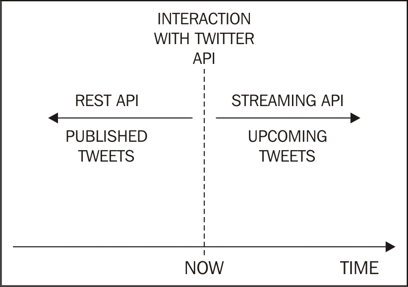

# Mining-Twitter-Data-with-Python
Mining-Twitter-Data-with-Python

### The Twitter API
#### Rate limits
The Twitter API limits access to applications. These limits are set on a per-user basis, or to be more precise, on a per-access-token basis. This means that when an application uses the application-only authentication, the rate limits are considered globally for the entire application; while with the per-user authentication approach, the application can enhance the global number of requests to the API.

The implications of hitting the API limits is that Twitter will return an **error message** rather than the data we're asking for. 
Moreover, if we continue performing more requests to the API, the time required to obtain regular access again will increase as Twitter could **flag us as potential abusers**. 

When many API requests are needed by our application, we need a way to avoid this.
In Python, the `time` module, part of the standard library, allows us to include arbitrary suspensions of the code execution, using the `time.sleep()` function. For example, a pseudo-code is as follows:
```
# Assume first_request() and second_request() are defined. 
# They are meant to perform an API request. 
import time 
 
first_request() 
time.sleep(10) 
second_request() 
```

#### Search versus Stream
Twitter provides more than a single API. In fact, it will be explained in the following section that there is more than one way to access Twitter data. To keep things simple, we can categorize our options into two classes: **REST APIs** and **Streaming API**:

<div align="center">
Figure 2.1: The time dimension of searching versus streaming
</div>

**REST API:** All the REST APIs only allow you to go back in time.

**Streming API:** On the other hand, the Streaming API looks into the future.

To summarize, the REST APIs are useful when we want to search for tweets authored by a specific user or we want to access our own timeline, while the Streaming API is useful when we want to filter a particular keyword and download a massive amount of tweets about it (for example, live events).

### Collecting data from Twitter
`$ pip install tweepy==3.3.0`

In order to promote the separation of concerns between application logic and configuration, we're **storing the credentials in environment variables**.

Changing configuration between different deployments (for example, using personal credentials for local tests and a company account for production) doesn't require any change in the code base. Moreover, environment variables don't get accidentally checked into your source control system for everyone to see.

Once the environment is set up, we will wrap the Tweepy calls to create the Twitter client into two functions: one that **reads the environment variables** and performs the authentication, and the other that **creates the API object needed to interface with Twitter.**

The reason for breaking the logic down into two separate functions is that **the authentication code can also be reused for the Streaming API**, as we'll discuss in the following sections.

As a Twitter user, your **home timeline** is the screen that you see when you log in to Twitter. It contains a sequence of tweets from the accounts you've chosen to follow, with the most recent and interesting tweets at the top.

`tweepy.Cursor` is an *iterable* object, meaning that it provides an easy-to-use interface to perform iteration and pagination over different objects.

The `status` variable used in the iteration represents an instance of `tweepy.Status`, which is a model used by Tweepy to wrap statuses (that is, tweets). 

**The JSON Lines format**  
The file in the preceding example has a .jsonl extension rather than just .json. In fact, this file is in the JSON Lines format (http://jsonlines.org/), meaning that each line of the file is a valid JSON document.  

Trying to load the entire content of this file with, for example, `json.loads()` will raise `ValueError` as the entire content is not a valid JSON document. Rather, if we're using functions that expect valid JSON documents, we need to process one line at a time.

The JSON Lines format is particularly well suited for **large-scale processing**: many big data frameworks allow the developers to easily split the input file into chunks that can be processed in parallel by different workers.

**Note:** we can only retrieve up to the most recent 800 tweets from our `home timeline`.
If we retrieve tweets from a specific user timeline, that is, using the `user_timeline` method rather than `home_timeline`, this limit is increased to 3,200.

This example shows two interesting aspects to consider when analyzing tweets, as follows:
- The entities are already labeled
- The user profile is fully embedded

The first point means that entity analysis is simplified as we do not need to explicitly search for entities such as hashtags, user mentions, embedded URLs, or media, because these are all provided by the Twitter API together with their offset within the text (the attribute called indices).

The second point means that we do not need to store user profile information somewhere else and then join/merge the data via a foreign key, for example. The user profile is, in fact, redundantly replicated within each tweet.

**Note:** Working with denormalized data  
The approach of embedding redundant data is related to the concept of denormalization. While normalization is considered a good practice in relational database design, denormalization finds its role in large-scale processing and databases that belong to the wide NoSQL family.

The rationale behind this approach is that the additional disk space required to redundantly store the user profile only has a marginal cost, while the gain (in terms of performances) obtained by removing the need for a join/merge operation is substantial.