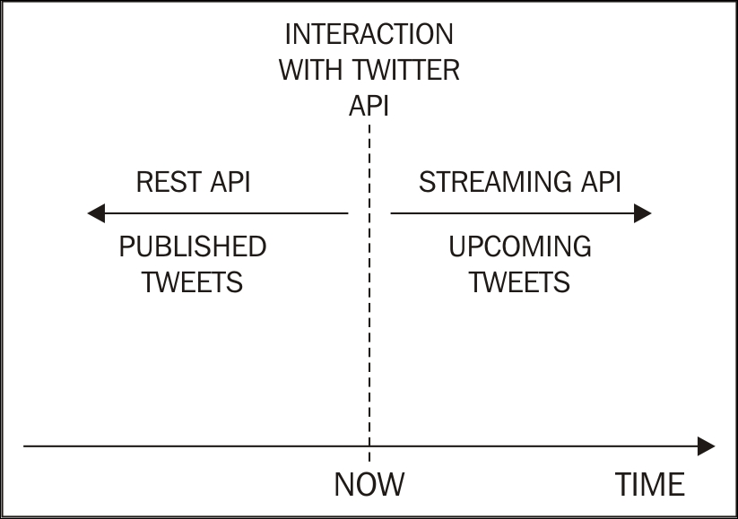

### The Twitter API
#### Rate limits
The Twitter API limits access to applications. These limits are set on a per-user basis, or to be more precise, on a per-access-token basis. This means that when an application uses the application-only authentication, the rate limits are considered globally for the entire application; while with the per-user authentication approach, the application can enhance the global number of requests to the API.

The implications of hitting the API limits is that Twitter will return an **error message** rather than the data we're asking for. 
Moreover, if we continue performing more requests to the API, the time required to obtain regular access again will increase as Twitter could **flag us as potential abusers**. 

When many API requests are needed by our application, we need a way to avoid this.
In Python, the `time` module, part of the standard library, allows us to include arbitrary suspensions of the code execution, using the `time.sleep()` function. For example, a pseudo-code is as follows:
```
# Assume first_request() and second_request() are defined. 
# They are meant to perform an API request. 
import time 
 
first_request() 
time.sleep(10) 
second_request() 
```

#### Search versus Stream
Twitter provides more than a single API. In fact, it will be explained in the following section that there is more than one way to access Twitter data. To keep things simple, we can categorize our options into two classes: **REST APIs** and **Streaming API**:

<div align="center">
Figure 2.1: The time dimension of searching versus streaming
</div>

**REST API:** All the REST APIs only allow you to go back in time.

**Streming API:** On the other hand, the Streaming API looks into the future.

To summarize, the REST APIs are useful when we want to search for tweets authored by a specific user or we want to access our own timeline, while the Streaming API is useful when we want to filter a particular keyword and download a massive amount of tweets about it (for example, live events).